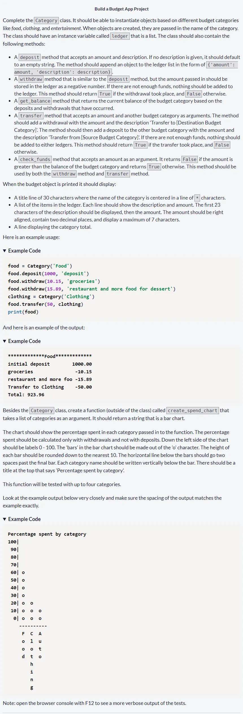
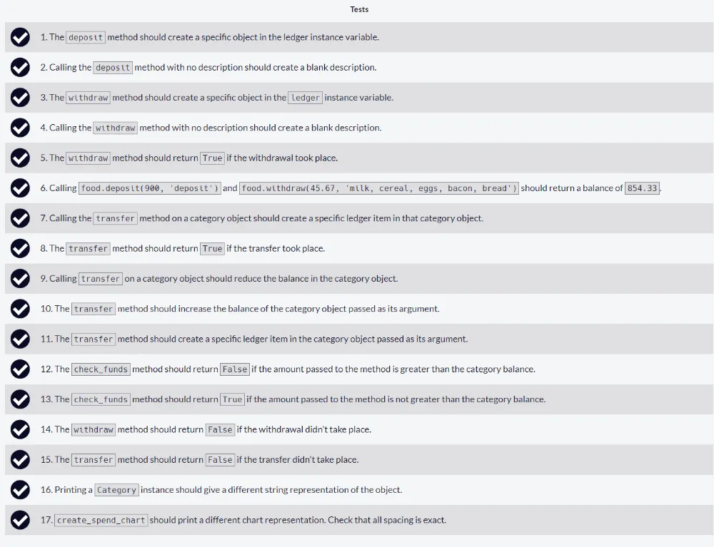
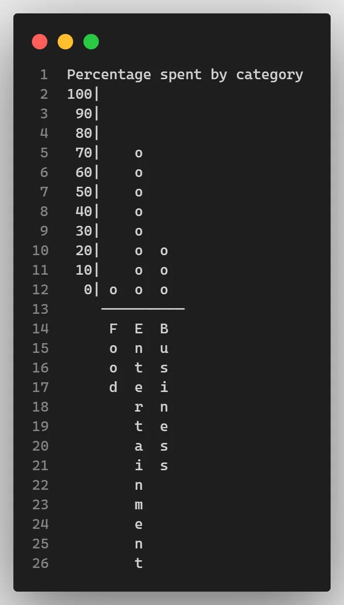

# Build a Budget App Project

Repositorio con el código solución al [tercer proyecto requisito obligatorio](https://www.freecodecamp.org/learn/scientific-computing-with-python/build-a-budget-app-project/build-a-budget-app-project) llamado **Build a Budget App Project** para obtener la [Freecodecamp Scientific Computing with Python Certification](https://www.freecodecamp.org/learn/scientific-computing-with-python)

## Tabla de Contenidos

- [Build a Budget App Project](#build-a-budget-app-project)
  - [Tabla de Contenidos](#tabla-de-contenidos)
  - [Instructions](#instructions)
  - [Approved Project](#approved-project)
  - [All Tests Passed](#all-tests-passed)
  - [Code Solution](#code-solution)
  - [Graph Output](#graph-output)

## Instructions



## Approved Project


## All Tests Passed



## Code Solution

```py
class Category:
    def __init__(self,name):
        self.name = name
        self.ledger = []
        self.balance=0

    def deposit(self, amount, description=""):
        self.ledger.append({"amount": amount, "description": description})
        self.balance += amount

    def check_funds(self, amount):
        return not self.balance < amount

    def withdraw(self, amount, description=""):
        if self.check_funds(amount):
            self.ledger.append({"amount": -amount, "description": description})
            self.balance -= amount
            return True
        else:
            return False

    def get_balance(self):
        return self.balance

    def transfer(self, amount, category):
        # amount is number
        # category is object from class Category
        if self.check_funds(amount):
            self.withdraw(amount, f"Transfer to {category.name}")
            category.deposit(amount, f"Transfer from {self.name}")
            return True
        else:
            return False

    def __str__(self):
        title = self.name.center(30, "*")
        items = ""
        total = self.balance
        for item in self.ledger:
            items += f"{item['description'][:23]:23}" + f"{item['amount']:>7.2f}" + "\n"
        output = title + "\n" + items + "Total: " + f'{total:.2f}'
        return output

def create_spend_chart(categories):
    # categories is a list of objects from class Category
    title='Percentage spent by category\n'
    percentages = []
    dict_percentages_categories = []
    max_length_titles_categories = 0
    for category in categories:
        total = 0
        for item in category.ledger:
            if item['amount'] < 0:
                total += item['amount']
        total = total * -1
        percentages.append(total)
        max_length_titles_categories = max(max_length_titles_categories, len(category.name))

    total = sum(percentages)
    for i in range(len(percentages)):
        current_percent = (percentages[i] / total) * 100
        dict_percentages_categories.append({'percent':current_percent-current_percent % 10, 'category': categories[i]})
    graph=''
    dict_percentages_categories.sort(key=lambda x: (x['percent']!=0, -x['percent']))
    for i in range(100, -10, -10):
        graph += f"{i:>3}|"
        for percentage in (dict['percent'] for dict in dict_percentages_categories):
            if percentage >= i:
                graph += ' o '
            else:
                graph += '   '
        graph += ' \n'
    graph += ' '*4 + ('-' * (len(categories) * 3 + 1)) + '\n'
    for i in range(max_length_titles_categories):
        graph += ' '*4
        for category in categories:
            if i < len(category.name):
                graph += f' {category.name[i]} '
            else:
                graph += '   '
        if i != max_length_titles_categories - 1:
            graph += ' \n'
        else:
            graph += ' '
    return (title + graph)
```

## Graph Output


